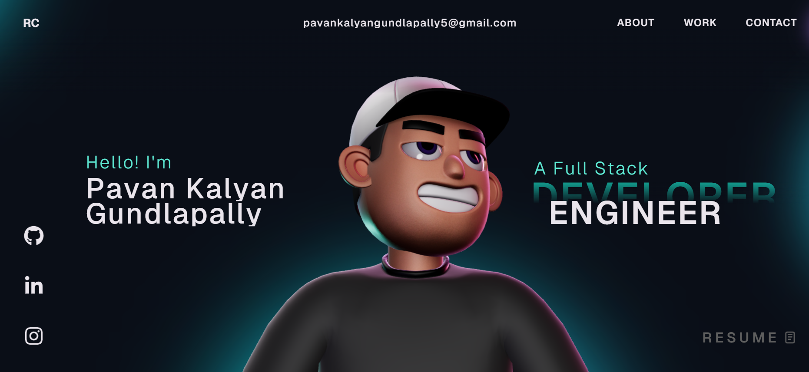

# Pavan Kalyan Gundlapally – Portfolio

This is my personal portfolio website showcasing my software engineering projects, technical skills, and professional experience.

## Tech Stack
React, TypeScript, GSAP, Three.js, WebGL, HTML, CSS, JavaScript

## Features
- Interactive portfolio UI
- Projects showcase section
- Skills and tech stack display
- Work experience section
- Resume download option
- Contact section

## Projects Highlighted
### Java Workflow Automation Engine
Backend microservices application built using Java and Spring Boot to orchestrate backend workflows through REST APIs. Implemented multithreading to improve throughput, optimized MySQL queries to reduce latency, containerized using Docker, and deployed on AWS EC2 with centralized logging and monitoring.

### Network Performance Monitoring Platform
Developed backend services using Node.js, NestJS, Java, and Python to enable real-time system analytics. Built React and NextJS dashboards for monitoring performance metrics and optimized SQL queries for improved response times.

## Author
Pavan Kalyan Gundlapally

GitHub: https://github.com/Pavankalyan2244